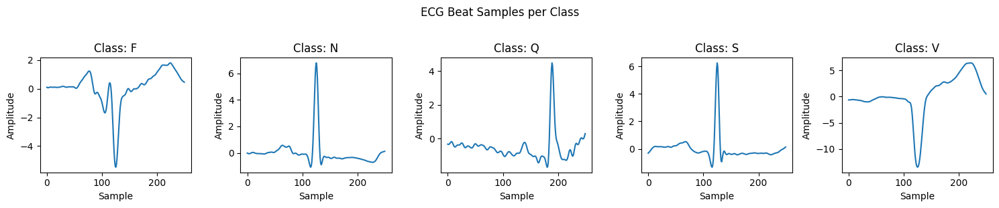
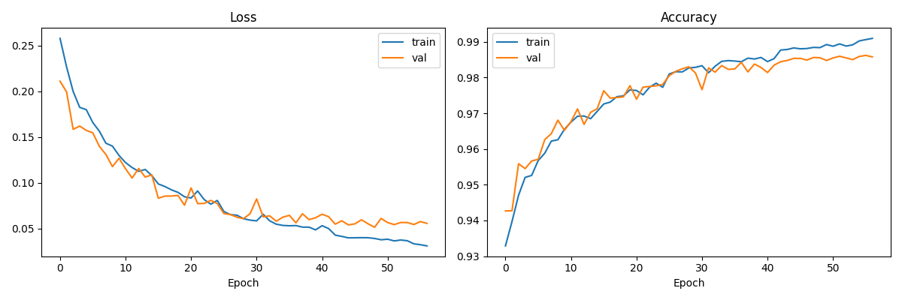
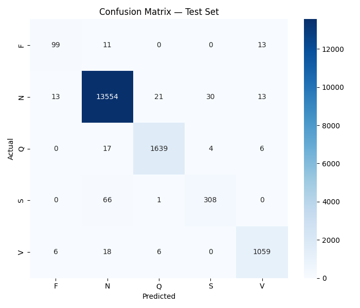

# ECG Arrhythmia Classifier

A deep learning pipeline for classifying cardiac arrhythmias from ECG signals using a stacked LSTM model trained on the MIT-BIH Arrhythmia Database.

## Overview

This project preprocesses raw ECG recordings, extracts individual heartbeat segments, and trains a neural network to classify them into five AAMI beat categories. The trained model achieves **99% accuracy** and a **0.99 weighted F1-score** on the held-out test set.

## Results

| Class | Description | Precision | Recall | F1 | Support |
|-------|-------------|-----------|--------|----|---------|
| N | Normal | 0.99 | 0.99 | 0.99 | 13,631 |
| V | Ventricular ectopic | 0.97 | 0.97 | 0.97 | 1,089 |
| S | Supraventricular ectopic | 0.90 | 0.82 | 0.86 | 375 |
| F | Fusion | 0.84 | 0.80 | 0.82 | 123 |
| Q | Unknown | 0.98 | 0.98 | 0.98 | 1,666 |
| **Weighted avg** | | **0.99** | **0.99** | **0.99** | **16,884** |

## Dataset

**MIT-BIH Arrhythmia Database** — 48 two-channel ECG recordings sampled at 360 Hz, downloaded automatically via the `wfdb` library.

After preprocessing, the dataset contains **112,561 labeled beats**:

| Class | Count | % |
|-------|-------|---|
| N (Normal) | ~82,400 | 73.2% |
| V (Ventricular) | ~15,500 | 13.8% |
| S (Supraventricular) | ~8,400 | 7.5% |
| Q (Unknown) | ~6,200 | 5.5% |
| F (Fusion) | ~279 | 0.2% |

## Project Structure

```
ecg_classifier/
├── preprocess.ipynb      # Signal filtering, beat extraction, label mapping
├── train.ipynb           # Model definition, training loop, evaluation
└── data/
    ├── mitdb/            # Raw MIT-BIH records (downloaded by preprocess.ipynb)
    ├── beats.npz         # Preprocessed beats (109 MB, output of preprocessing)
    ├── ecg_lstm.pt       # Saved model weights (484 KB)
    ├── sample_beats.png  # One representative beat per class
    ├── training_curves.png
    └── confusion_matrix.png
```

## Preprocessing Pipeline (`preprocess.ipynb`)

1. Downloads all 48 MIT-BIH records using `wfdb`
2. Applies a 4th-order Butterworth bandpass filter (0.5–40 Hz)
3. Extracts a 250-sample window (≈694 ms at 360 Hz) centered on each annotated R-peak
4. Normalizes each beat to zero mean and unit variance
5. Maps raw AAMI annotation symbols to the five target classes
6. Saves features and labels to `data/beats.npz`

## Model Architecture (`train.ipynb`)

**ECGClassifier** — 121,605 trainable parameters

```
Input (250,) → unsqueeze → (250, 1)
├── LSTM(1 → 128)  + Dropout(0.3) + BatchNorm1d(128)
├── LSTM(128 → 64) + Dropout(0.3) + BatchNorm1d(64)
└── Linear(64 → 64) → ReLU → Dropout(0.25) → Linear(64 → 5)
```

| Hyperparameter | Value |
|----------------|-------|
| Optimizer | Adam (lr = 1e-3) |
| LR scheduler | ReduceLROnPlateau (factor=0.5, patience=4) |
| Early stopping | patience = 8 epochs |
| Batch size | 128 |
| Train / Val / Test split | 70% / 15% / 15% |
| Random seed | 0 |

Training converged at epoch 57 (early stopping).

## Setup

### Prerequisites

- Python 3.8+
- Jupyter Notebook or JupyterLab

### Install dependencies

```bash
pip install torch wfdb scikit-learn scipy numpy matplotlib seaborn tqdm
```

### Run

1. **Preprocess** — run `preprocess.ipynb` end-to-end. This downloads the MIT-BIH database (~100 MB) and writes `data/beats.npz`.

2. **Train** — run `train.ipynb` end-to-end. This trains the model and saves weights to `data/ecg_lstm.pt`.

If `data/beats.npz` already exists you can skip step 1 and go straight to training.

## Visualizations

**Sample beats per class**



**Training curves**



**Confusion matrix (test set)**



## Notes

- Only the first channel of each two-channel MIT-BIH recording is used.
- The F (Fusion) class is heavily underrepresented (0.2% of data), which explains the slightly lower recall compared to other classes.
- All random seeds are fixed for reproducibility.
